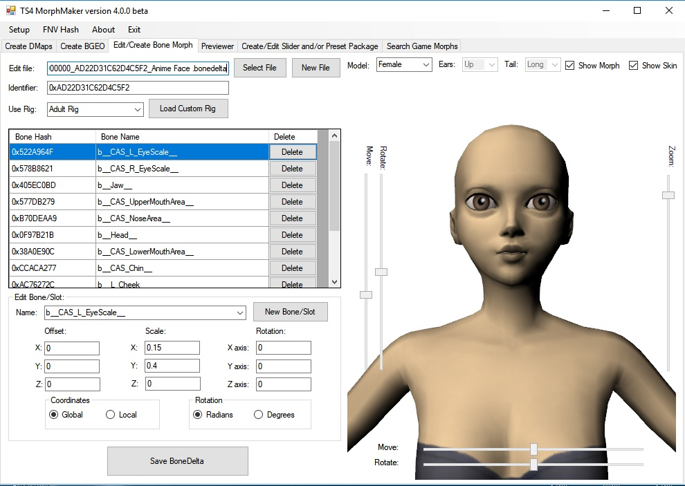

# TS4 MorphMaker - updated to V4.5.2.1 on 2024-01-24

* This is a fork from MTS. 
* Original description by [CmarNYC](https://modthesims.info/member.php?u=3216596) who retired on earth and is now supporting the TS4 development in heaven.

## Description

This tool makes custom TS4 morphs from base and morphed meshes and packages them in CAS sliders and presets.

Supports all species/ages/genders/frames/occults.

Meshing can be done using any 3D editor that will import and export OBJ without changing the vertex order or the face sequence or the group/object names. Tested with Milkshape and Blender.

To use: Download the TS4MorphMaker program zip file, extract, open the folder and run TS4MorphMaker.exe

There are three tutorials posted which have much more complete information and instructions:

* [Making a CAS slider with TS4MorphMaker using a DeformerMap](http://www.modthesims.info/showthread.php?t=613057)
* [Making a CAS preset with TS4MorphMaker using a BGEO](http://www.modthesims.info/showthread.php?t=613060)
* [Making a Cat Body Preset and Fur Preset with TS4 MorphMaker using EA Morphs and a Deformer Map](http://www.modthesims.info/showthread.php?t=618920)
* [Using TS4 MorphMaker to relocate sliders](https://modthesims.info/showthread.php?t=665790)

Check back for updates - now that people are using the tool I'm fixing bugs and updating often.

If something doesn't work, please check to see if an update has fixed it. If not, please report any bugs in the comments, giving as much information as possible. Please upload your meshes if you're having trouble making a BGEO or DMap. Please upload your package if it's not working as expected in CAS or the game. If you'd rather not upload, pm me with a link.

Note that the bone delta editor hasn't had much testing, and that support for morphs of custom meshes is mostly untested.

Additional Credits:
s4pe/s4pi is used by MorphMaker for package and image handling. s4pi/s4pe and MorphMaker are open source.
* [s4pe download](https://github.com/s4ptacle/Sims4Tools/releases)
* [Latest working s4pi source](https://github.com/s4ptacle/Sims4Tools/tree/develop)

With thanks to [lumialover8](https://modthesims.info/member.php?u=7814003) for encouragement and lots and lots of testing. His beautiful sets of ear and hand sliders and presets made with MorphMaker are [here](https://luumiasims.com/post/174006296684/the-sims-as-a-franchise-might-be-headed-toward-a).

### Updates
#### V4.5.2.1, 2024-01-24:
- No new features
- Code patched to compile it with VS 2022
- References to werewolves
- Code shared to keep it alive.
- I'm not a C# developer, please fork this repository to create new versions. 

#### Screenshots

### Updates
#### V4.5.2, 4/19/23:
- Updated for 4/18/2023 patch. This version will not read two DeformerMaps: the m to f and f to m frame morphs. These two DMaps have been updated to a new version that MorphMaker can't yet read.
- Will also skip all corrupted or unreadable morph resources instead of throwing an error.

#### V4.5.1, 3/26/23:
- Fixed bug causing a female base mesh to be exported when the male mesh is selected in the DMaps tab.

#### V4.5, 3/20/23:
- Added support for infants and werewolves.
- Fixed bug causing crashing when working with a HotSpotControl with no associated sliders.
I've only done basic testing, so please report errors as always.

#### V4.4.2
Support for the new version of HotSpotControl introduced in the June 2022 werewolf patch:
To fix old slider packages broken by the patch:
- Open the package in the 'Create/Edit Slider and/or Preset Package' tab
- When it asks whether to update the HotSpotControls, click Yes
- Save as a new package
This is likely an interim version since the new data added to the HotSpotControl may turn out to mean something for werewolves.

#### V4.4.1
Added support for the LRLE image format.
Added ability to append slider/preset packages.

#### V4.3
Head distortion in DMap preview of certain morphs is fixed.
Bone morphs for preview have been reworked, but animal meshes are still distorting so it needs more work.

#### V4.2
Support added for mermaids and witches.

#### V4.1
Corrections to the bone delta editor which hopefully will fix the issue of numbers randomly changing for some users, probably affecting users in countries that use a comma instead of a period as the decimal marker. I can't test this myself, however.
Improvement to the accuracy of bone morph previews.

#### V4.0-beta
Bone Delta Editor (this part is still beta):

    Will now interactively show you the effect of bone morphs as you change values.
    Now allows values to be edited using either global/world or local coordinate system.

All previews now include bone morphs.
Exports of morphed meshes from previews now include bone morphs.
Preset regions which are not supported by the game have been removed from the preset options.

#### V3.0-beta
This is a beta since there are a lot of changes, and the previous version is still available until this one is final.
Enhancements:

    Full support for cat and dog sliders and presets added.
    The DeformerMap creation has been substantially rewritten to produce smoother and more accurate maps which are also a bit faster to make. The problem of morphs 'smearing' into the wrong areas and causing distortion should now be gone. Any bumpiness in very high poly meshes should be gone.
    *Note this exception: In human sims the fingers and inner mouth are mapped onto the same area of the uv1 so DMap morphs cannot be used for either part without distorting the other.
    Sculpts now include the full set of textures (material, normalmap, specular) and bone deltas.
    Small fixes and changes.

Bugfix: Export of morphs included tiny inaccuracies due to rounding error causing distortion when exported whole body morphs were used as a morph mesh. This has been corrected.

#### V2.3.2
Bugfix: Corrected bug causing body preset custom thumbnails to not show up. (Use this version to open and save a package with body preset thumbs to fix it.)
Changes: The thumbnail import/export window will now resize correctly. The preset sort order will display as a decimal number.

#### V2.3.1
Bugfix: Correction of bug in HotSpotControl display causing gender restriction flags to be incorrectly checked in some conditions.
Changes: Addition of custom regions for Sim Modifiers, for use in body presets meant to affect only one body part. Choice of regions in presets restricted to regions that can have presets. Cosmetic and informational changes to screens.

#### V2.3.0
Bugfix: Correction of bug in the Tight Boundaries option of DMap creation which caused erroring out.
Changes: Addition of mesh export from all previews, including previews of presets, sculpts, and sim modifiers. Exported meshes can now be modified and used as a morph mesh with the correct standard base mesh for the age/gender.

#### V2.2.7
Bugfix: Correction of DMap compression bug introduced in previous fix, affecting base/morph pairs of any size with areas of unchanged normals. Anyone using V2.2.6 should update immediately.
Change: Body meshes exported from the Previewer tab will now include the head.

#### V2.2.6
Bugfix: Correction of bug in whole body compressed DMap creation, resulting in a DMap with bad data. Anyone working with whole body size DMaps should update.
Change: A few user error checks added. 
